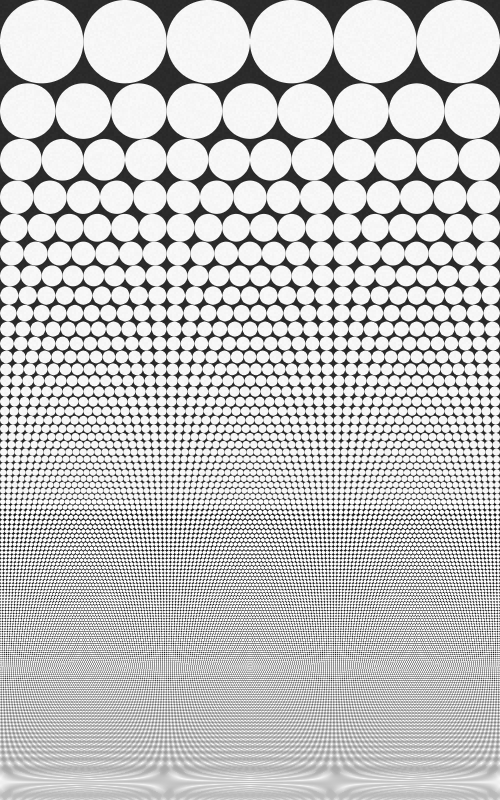
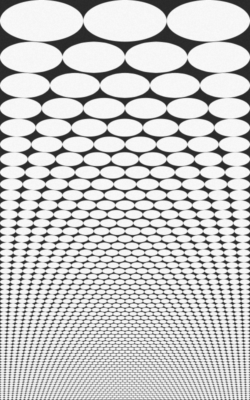
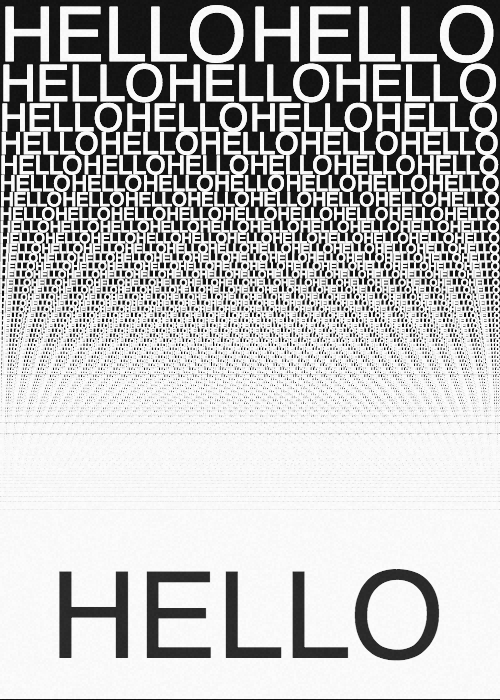
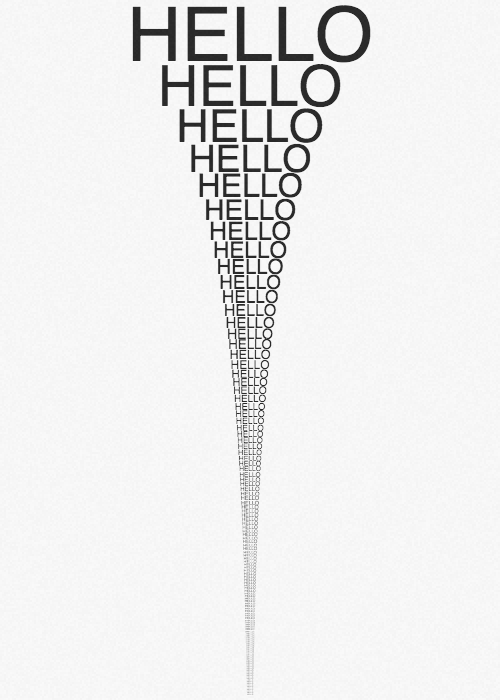

Inspired by this poster from John Maeda :
https://twitter.com/johnmaeda/status/513487242451767296

An quick and easy way to do a line packing. Return some pretty cool results when you play around with the h and w values. Contains a pretty cool paper texture i found on OpenProcessing but can't find the source back. Let me know if you recognize your function :)

circleBasic.js

Everything is done using p5.js : https://p5js.org/
Have fun with this and let me know if you make anything cool with this :)
