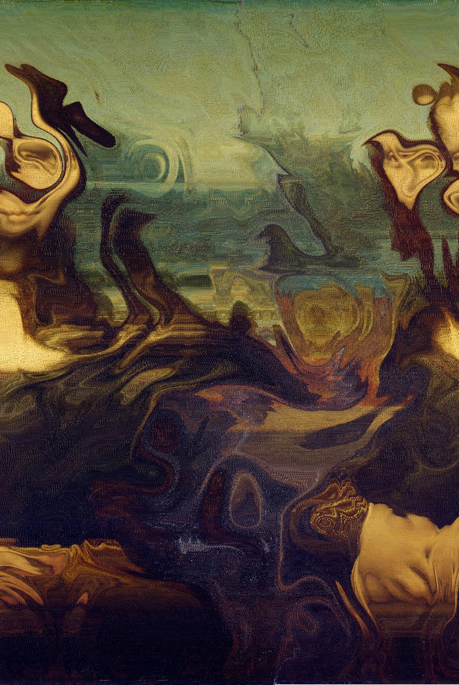

Inspired by this article :
http://www.iquilezles.org/www/articles/warp/warp.html

This function map the pixels, push the value along an array according
to a certain noise and then update the pixels. Due to the way the pixel array works in p5.js, it can only be pushed on the x-axis and if it reaches the width, it will be pushed to the next line.

images source : https://en.wikipedia.org/wiki/Mona_Lisa

 

Everything is done using p5.js : https://p5js.org/ \
Have fun with this and let me know if you make anything cool with this :)
